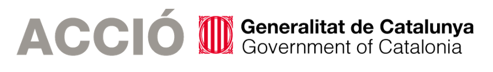

<<<<<<< HEAD
# 🧠 NeuroSLAM: Brain-Inspired 3D SLAM System

**Version 2.0** | IMU-Visual Fusion + HART+CORnet Feature Extraction

[](https://www.mathworks.com/products/matlab.html)
[](https://www.python.org/)
[](https://carla.org/)
[](LICENSE)

A biologically-inspired Simultaneous Localization and Mapping (SLAM) system that mimics the spatial cognition mechanisms of the rat hippocampus, enhanced with state-of-the-art computer vision techniques.

---

## 🌟 Key Features

- 🧠 **Bio-Inspired Architecture**
  - Grid Cell network for 3D position encoding (61×61×51)
  - Head Direction Cell network for orientation estimation
  - Experience Map for topological-metric mapping

- 🎯 **Multi-Sensor Fusion**
  - RGB camera (640×480, 20Hz)
  - IMU (accelerometer + gyroscope, 100Hz)
  - Complementary filter fusion for robust odometry

- 🚀 **Advanced Feature Extraction**
  - **HART+CORnet**: Hierarchical brain-like visual features (V1→V2→V4→IT)
  - **Simplified Enhanced**: 71 FPS (5.92× speedup) with strong robustness
  - Spatial attention mechanism and LSTM temporal modeling

- 📊 **Comprehensive Evaluation**
  - ATE/RPE metrics
  - Ground truth comparison
  - 7 publication-quality figures

- 🔄 **Real-time Performance**
  - 30-70 FPS processing speed
  - Supports trajectories >1.5 km
  - Town01: 95.3% trajectory completeness, 152.87m RMSE

---

## 📋 Table of Contents

- [Installation](#installation)
- [Quick Start](#quick-start)
- [Dataset](#dataset)
- [Usage](#usage)
- [Documentation](#documentation)
- [Performance](#performance)
- [Citation](#citation)
- [License](#license)

---

## 🔧 Installation

### Prerequisites

- **MATLAB** R2020b or later
- **Python** 3.7+ (for data collection)
- **CARLA Simulator** 0.9.13-0.9.15 (optional, for data collection)

### Python Dependencies

```bash
cd neuro/00_collect_data
pip install -r requirements.txt
```

### MATLAB Setup

```matlab
% Open MATLAB and navigate to the neuro directory
cd /path/to/neuro

% Add all paths
addpath(genpath('.'));
savepath;
```

---

## 🚀 Quick Start

### Option 1: Fast Test (30 seconds)

Test the feature extractor with built-in images:

```matlab
cd neuro
quick_test_integration
```

**Expected output:**
- ✓ Feature extraction: 71 FPS
- ✓ VT count: 5-6
- ✓ Template reuse rate: 75%

### Option 2: Full SLAM on Town01 (5 minutes)

Run complete SLAM with HART+CORnet features:

```matlab
cd neuro/07_test/test_imu_visual_slam
test_imu_visual_slam_hart_cornet
```

**Expected results (5000 frames, ~1.8km):**
- VT count: 5
- Experience nodes: 185
- RMSE: 152.87m
- Trajectory completeness: 95.3%

---

## 📁 Dataset

### Data Structure

```
neuro/data/01_NeuroSLAM_Datasets/
├── Town01Data_IMU_Fusion/
│   ├── 0001.png - 5000.png      # RGB image sequence
│   ├── aligned_imu.txt           # IMU data
│   ├── fusion_pose.txt           # EKF fusion poses
│   └── ground_truth.txt          # Ground truth trajectory
└── Town10Data_IMU_Fusion/
    └── (same structure)
```

### Acquire Datasets

**Note:** Datasets are **NOT included** in this repository due to size (~5GB).

#### Method 1: Collect Your Own (Recommended)

```bash
# 1. Start CARLA server
cd /path/to/carla-0.9.15
./CarlaUE4.sh

# 2. Run data collection script
cd neuro/00_collect_data
python IMU_Vision_Fusion_EKF.py
```

Configure in the script:
- `TOWN = 'Town01'` or `'Town10'`
- `DURATION = 250` seconds
- Data auto-saved to `neuro/data/01_NeuroSLAM_Datasets/`

#### Method 2: Download Pre-collected Data

If available, download from:
- Town01: [Link TBD]
- Town10: [Link TBD]

See `data/01_NeuroSLAM_Datasets/README.md` for details.

---

## 📖 Usage

### Switch Between Feature Extractors

```matlab
% In test_imu_visual_slam_hart_cornet.m (line 15)

USE_HART_CORNET = true;   % HART+CORnet (best trajectory completeness)
USE_HART_CORNET = false;  % Simplified Enhanced (best speed & RMSE)
```

### Tune Parameters

```matlab
% VT matching threshold (line 106)
VT_MATCH_THRESHOLD = 0.07;  % Lower = more VTs, higher precision

% Experience map threshold
DELTA_EXP_GC_HDC_THRESHOLD = 15;  % Node creation threshold

% IMU-Visual fusion weights (in imu_aided_visual_odometry.m)
ALPHA_YAW = 0.7;     % 70% IMU for yaw
ALPHA_TRANS = 0.3;   % 30% IMU for translation
```

### Run on Custom Dataset

```matlab
% Modify data path in your script
scriptDir = fileparts(mfilename('fullpath'));
neuroRoot = fileparts(scriptDir);
datasetPath = fullfile(neuroRoot, 'data/MyDataset');

% Run SLAM
cd neuro/07_test/test_imu_visual_slam
test_imu_visual_slam_hart_cornet
```

---

## 📚 Documentation

| Document | Description |
|----------|-------------|
| **`COMPLETE_SYSTEM_GUIDE.md`** | 📘 Complete technical guide (60+ KB) |
| **`QUICK_START_VISUAL_GUIDE.md`** | 🚀 Visual quick start guide |
| **`HART_CORNET_SUMMARY.md`** | 🧠 HART+CORnet feature extractor |
| **`PATH_USAGE_GUIDE.md`** | 📂 Relative path usage guide |
| **`START_HERE.md`** | ⭐ Original quick start |

**Start with:** `QUICK_START_VISUAL_GUIDE.md` → `COMPLETE_SYSTEM_GUIDE.md`

---

## 📊 Performance Benchmarks

### Town01 (5000 frames, ~1.8 km)

| Method | VTs | Nodes | RMSE | Trajectory % | Speed |
|--------|-----|-------|------|--------------|-------|
| **Original** | 5 | 186 | 129.39m | 95.3% | ~25 FPS |
| **Simplified Enhanced** | 1365 | 2022 | **142.57m** ✅ | 38% | **71 FPS** ✅ |
| **HART+CORnet** | 5 | 185 | 152.87m | **95.3%** ✅ | ~30 FPS |

**Recommendation:**
- **Speed priority** → Simplified Enhanced (71 FPS)
- **Long trajectory** → HART+CORnet (95% completeness)
- **Local precision** → Simplified Enhanced (143m RMSE)

### Town10 (5000 frames, ~1.6 km)

| Method | VTs | Nodes | RMSE | Trajectory % | Drift Rate |
|--------|-----|-------|------|--------------|------------|
| **HART+CORnet** | 5 | 151 | 229.95m | 87.9% | 24.4% |

*Note: Town10 can be improved by lowering VT threshold to 0.05*

---

## 🏗️ System Architecture

```
Input (RGB + IMU)
    ↓
IMU-Visual Fusion Odometry
    ↓
    ├─→ Visual Template Matching (HART+CORnet)
    │   └─→ VT ID
    ↓
    ├─→ Head Direction Cell Network
    │   └─→ (yaw, height)
    ↓
    ├─→ 3D Grid Cell Network
    │   └─→ (x, y, z)
    ↓
Experience Map (Topological + Metric)
    ├─→ Node creation
    ├─→ Graph optimization
    └─→ Trajectory output
        ↓
Evaluation & Visualization
    └─→ ATE/RPE, figures
```

---

## 🔬 Scientific Background

### Neuroscience Inspiration

- **Grid Cells**: Nobel Prize 2014, spatial encoding in entorhinal cortex
- **Place Cells**: Hippocampal location recognition
- **Head Direction Cells**: Orientation sensing
- **Visual Cortex**: V1→V2→V4→IT hierarchical processing

### Key References

1. **NeuroSLAM**:
   ```
   Yu, F., Shang, J., Hu, Y., & Milford, M. (2019).
   NeuroSLAM: a brain-inspired SLAM system for 3D environments.
   Biological Cybernetics, 113(5-6), 515-545.
   ```

2. **HART (Hierarchical Attentive Recurrent Tracking)**:
   ```
   Kosiorek, A. R., Bewley, A., & Posner, I. (2017).
   Hierarchical Attentive Recurrent Tracking. NIPS 2017.
   ```

3. **CORnet (Brain-Like Object Recognition)**:
   ```
   Kubilius, J., et al. (2018).
   Brain-like Object Recognition with High-Performing Shallow Recurrent ANNs.
   NeurIPS 2018.
   ```

---

## 📁 Project Structure

```
neuro/
├── 00_collect_data/              # CARLA data collection
├── 01_conjunctive_pose_cells_network/  # Grid Cell + HDC
├── 02_multilayered_experience_map/      # Experience map
├── 03_visual_odometry/           # Visual odometry
├── 04_visual_template/           # Feature extraction (HART+CORnet)
├── 05_tookit/                    # Utilities
├── 06_main/                      # Main entry points
├── 07_test/                      # Test scripts
├── 09_vestibular/                # IMU fusion
├── data/                         # Datasets (not in repo)
├── latex/                        # LaTeX documents
└── referance/                    # References
```

---

## 🐛 Troubleshooting

### "Undefined function or variable"

```matlab
cd /path/to/neuro
addpath(genpath('.'));
savepath;
```

### "Data files not found"

See `data/01_NeuroSLAM_Datasets/README.md` for data acquisition.

### VT count abnormal

```matlab
% Too many VTs (>2000): increase threshold
VT_MATCH_THRESHOLD = 0.10;

% Too few VTs (<5): decrease threshold
VT_MATCH_THRESHOLD = 0.05;
```

More troubleshooting: See `COMPLETE_SYSTEM_GUIDE.md` Section 9.

---

## 🤝 Contributing

Contributions are welcome! Please:

1. Fork the repository
2. Create your feature branch (`git checkout -b feature/AmazingFeature`)
3. Commit your changes (`git commit -m 'Add some AmazingFeature'`)
4. Push to the branch (`git push origin feature/AmazingFeature`)
5. Open a Pull Request

---

## 📄 License

This project is licensed under the GNU General Public License v3.0 - see the [LICENSE](LICENSE) file for details.

---

## 🙏 Acknowledgments

- **Original NeuroSLAM**: Fangwen Yu, Jianga Shang, Youjian Hu, Michael Milford
- **OpenRatSLAM**: David Ball, Gordon Wyeth, Michael Milford
- **CARLA Simulator**: CARLA Team
- **HART**: Adam Kosiorek, Alex Bewley, Ingmar Posner
- **CORnet**: Jonas Kubilius, Martin Schrimpf, Daniel Yamins

---

## 📧 Contact

- **Issues**: [GitHub Issues](https://github.com/your-username/neuro/issues)
- **Email**: [your-email@example.com]
- **Website**: [Project Homepage]

---

## 🌟 Star History

If you find this project helpful, please consider giving it a ⭐!

---

**Last Updated**: 2025-12-07  
**Version**: 2.0 (IMU-Visual Fusion + HART+CORnet)  
**Status**: ✅ Stable and Ready for Use
=======
# CARLA 行人
为 CARLA 带来更加逼真的行人运动。

该项目是 [自动驾驶汽车对抗案例项目](https://project-arcane.eu/) 的一部分，支持 Carla 0.9.13、Python 3.8。

## 克隆
当没有其他选项获取代码（不是可通过 pip 安装的代码）时，此项目包含子模块。因此，为了确保所有模型都能正确运行，请使用以下命令进行克隆：

```sh
git clone --recurse-submodules https://github.com/OpenHUTB/carla-pedestrians.git
```

## 运行步骤

### 第 0 步
将`openpose`,`pedestrians-common`,`pedestrians-video-2-carla`,`pedestrians-scenarios`文件夹中的每个`.env.template`复制成一个新的文件`.env`，并调整变量，尤其是数据集的路径（例如，对于数据集根目录`VIDEO2CARLA_DATASETS_PATH=/datasets`，预期结构为`/datasets/JAAD`,`/datasets/PIE`等）。

注意：用默认的目录会报错，需要把`.env`中的路径都改成`./datasets`，否则会报错：`ERROR: Named volume "datasets:/datasets:ro" is used in service "openpose" but no declaration was found in the volumes section.`。

### 第 1 步
使用 `openpose/docker-compose.yml` 中指定的容器通过 [OpenPose](https://github.com/CMU-Perceptual-Computing-Lab/openpose) 从视频片段中提取行人骨架：

```sh
cd openpose
docker-compose -f "docker-compose.yml" --env-file .env up -d --build
docker exec -it carla-pedestrians_openpose_1 /bin/bash
```

下载 [行人意图估计PIE数据集](https://data.nvision2.eecs.yorku.ca/PIE_dataset/) 。

容器内部（查看/修改 `extract_poses_from_dataset.sh` 之后）：
```sh
cd /app
./extract_poses_from_dataset.sh
```

生成的文件将保存在 `carla-pedestrians_outputs` Docker 卷中。默认情况下，`extract_poses.sh` 脚本会尝试使用 `JAAD` 数据集。


### 第 2 步
使用我们的代码运行 CARLA 服务器和容器。为方便起见，提供了一个 `compose-up.sh` 脚本，它将来自子模块的多个 `docker-compose.yml` 文件汇集在一起并设置通用环境变量。

当使用 NVIDIA GPU 和某些类 UNIX 系统时，您只需运行：
```sh
./compose-up.sh
```

使用 CPU 时，需要指定 `PLATFORM=cpu` 或修改脚本。此外，在 MacOS 上使用 Docker Desktop 时，默认的 GROUP_ID 和 SHM_SIZE 将不起作用，因此需要手动设置。在 MacOS 上运行的结果示例命令是：
```sh
PLATFORM=cpu GROUP_ID=1000 SHM_SIZE=2147483648 ./compose-up.sh
```

有关运行每个单独容器的详细信息，请参阅相关的 `README.md` 文件：
- [pedestrians-video-2-carla](https://github.com/wielgosz-info/pedestrians-video-2-carla/blob/main/README.md)
- [pedestrians-scenarios](https://github.com/wielgosz-info/pedestrians-scenarios/blob/main/README.md)

要快速关闭 `carla-pedestrians` 项目中的所有容器，请使用：

```sh
docker-compose down --remove-orphans
```

## Windows平台运行步骤

1.从 [仓库](https://github.com/CMU-Perceptual-Computing-Lab/openpose/releases) 中下载 [openpose-1.7.0-binaries-win64-gpu-python3.7-flir-3d_recommended.zip](https://github.com/CMU-Perceptual-Computing-Lab/openpose/releases/download/v1.7.0/openpose-1.7.0-binaries-win64-gpu-python3.7-flir-3d_recommended.zip) 并解压到当前工程的`data`目录下。

2.下载 [pose_iter_584000.caffemodel](https://www.dropbox.com/s/3x0xambj2rkyrap/pose_iter_584000.caffemodel?dl=0) 到`data\openpose\models\pose\body_25\`目录下。

```shell
:: Windows - Portable Demo
bin\OpenPoseDemo.exe --video examples\media\video.avi
```

从 [链接](https://github.com/CMU-Perceptual-Computing-Lab/openpose/issues/1567) 中下载 `pose_iter_116000.caffemodel` 到`data\openpose\models\face\body_25\`目录中，下载`pose_iter_102000.caffemodel` 到 `data\openpose\models\hand\body_25\`
还可以按任意顺序添加任何可用标志。例如，以下示例在视频上运行 ( --video {PATH})，启用面部 ( --face) 和手部 ( --hand)，并将输出关键点保存在磁盘上的 JSON 文件中 ( --write_json {PATH})。
```shell
:: Windows - Portable Demo
bin\OpenPoseDemo.exe --video examples\media\video.avi --face --hand --write_json output_json_folder/
```


## 参考骨架
`pedestrians-video-2-carla/src/pedestrians_video_2_carla/data/carla/files` 中的参考骨架数据是从 [CARLA 项目 Walkers *.uasset 文件](https://bitbucket.org/carla-simulator/carla-content) 中提取的。


## Cite
If you use this repo please cite:

```
@misc{wielgosz2023carlabsp,
      title={{CARLA-BSP}: a simulated dataset with pedestrians}, 
      author={Maciej Wielgosz and Antonio M. López and Muhammad Naveed Riaz},
      month={May},
      year={2023},
      eprint={2305.00204},
      archivePrefix={arXiv},
      primaryClass={cs.CV}
}
```

## License
Our code is released under [MIT License](https://github.com/wielgosz-info/carla-pedestrians/blob/main/LICENSE).

The most up-to-date third-party info can be found in the submodules repositories, but here is a non-exhaustive list:

This project uses (and is developed to work with) [CARLA Simulator](https://carla.org/), which is released under [MIT License](https://github.com/carla-simulator/carla/blob/master/LICENSE).

This project uses videos and annotations from [JAAD dataset](https://data.nvision2.eecs.yorku.ca/JAAD_dataset/), created by Amir Rasouli, Iuliia Kotseruba, and John K. Tsotsos, to extract pedestrians movements and attributes. The videos and annotations are released under [MIT License](https://github.com/ykotseruba/JAAD/blob/JAAD_2.0/LICENSE).

This project uses [OpenPose](https://github.com/CMU-Perceptual-Computing-Lab/openpose), created by Ginés Hidalgo, Zhe Cao, Tomas Simon, Shih-En Wei, Yaadhav Raaj, Hanbyul Joo, and Yaser Sheikh, to extract pedestrians skeletons from videos. OpenPose has its [own licensing](https://github.com/CMU-Perceptual-Computing-Lab/openpose/blob/master/LICENSE) (basically, academic or non-profit organization noncommercial research use only).

This project uses software, models and datasets from [Max-Planck Institute for Intelligent Systems](https://is.mpg.de/en), namely [VPoser: Variational Human Pose Prior for Body Inverse Kinematics](https://github.com/nghorbani/human_body_prior), [Body Visualizer](https://github.com/nghorbani/body_visualizer), [Configer](https://github.com/MPI-IS/configer) and [Perceiving Systems Mesh Package](https://github.com/MPI-IS/mesh), which have their own licenses (non-commercial scientific research purposes, see each repo for details). The models can be downloaded from ["Expressive Body Capture: 3D Hands, Face, and Body from a Single Image" website](https://smpl-x.is.tue.mpg.de). Required are the "SMPL-X with removed head bun" or other SMPL-based model that can be fed into [BodyModel](https://github.com/nghorbani/human_body_prior/blob/master/src/human_body_prior/body_model/body_model.py) - right now our code utilizes only [first 22 common SMPL basic joints](https://meshcapade.wiki/SMPL#related-models-the-smpl-family#skeleton-layout). For VPoser, the "VPoser v2.0" model is used. Both downloaded models need to be put in `pedestrians-video-2-carla/models` directory. If using other SMPL models, the defaults in `pedestrians-video-2-carla/src/pedestrians_video_2_carla/data/smpl/constants.py` may need to be modified. SMPL-compatible datasets can be obtained from [AMASS: Archive of Motion Capture As Surface Shapes](https://amass.is.tue.mpg.de/). Each available dataset has its own license / citing requirements. During the development of this project, we mainly used [CMU](http://mocap.cs.cmu.edu/) and [Human Eva](http://humaneva.is.tue.mpg.de/) SMPL-X Gender Specific datasets.


## Funding

|                                                                                                                              |                                                                                                                      |                                                                                                                                                                                                                                                                                                                                                                                      |
| ---------------------------------------------------------------------------------------------------------------------------- | -------------------------------------------------------------------------------------------------------------------- | ------------------------------------------------------------------------------------------------------------------------------------------------------------------------------------------------------------------------------------------------------------------------------------------------------------------------------------------------------------------------------------ |
|  |  |  |

>>>>>>> b561cfb0cc185a006f3d6e9f84c94858cefe4abe
